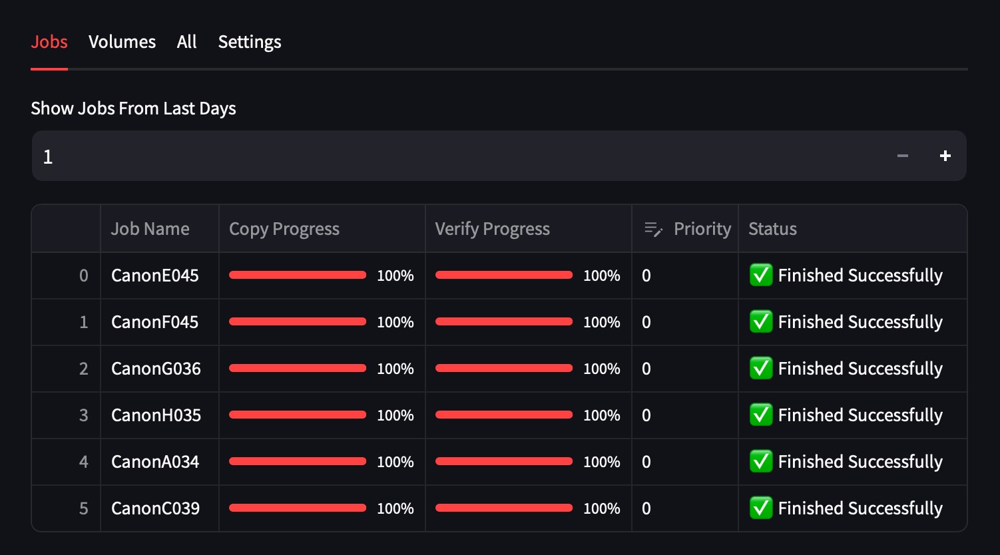

A basic Python tool for viewing the sqlite database of Pomfort Silverstack and Offload Manager apps in your web browser.




### Dependancies
```
pip install streamlit
pip install sqlite3
pip install pandas
```

### Run the script:
```
streamlit run pomfort_db_explorer.py
```


### Usage
You Mac should open a web browser window displaying tabs for:
- Current jobs / offloads
- Volumes
- contents of the entire database
- settings


